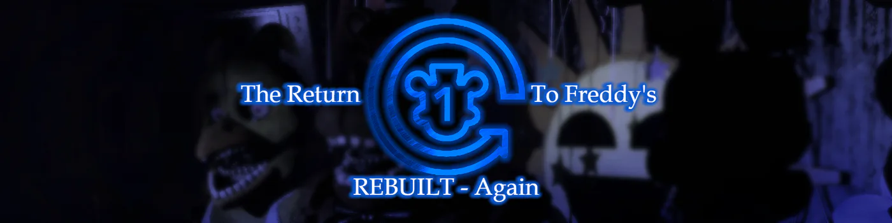

# The Return To Freddy's Rebuilted - Again

> [!IMPORTANT]
> This game is not an official remake and its creator is not involved in this project or anything, it was just made by 2 people who wanted to improve the original concept with new models, improvements and added elements.
> This is an improved version of the fangame "TRTF Rebuilt" game originally developed by MoonieGlare/Black Moon Studios with new models, re-made map and some changes.

> [!WARNING]
> *This is an experimental game because it is a practice project* 

## HISTORY

After the big incident of Fredbear's Family Diner, in 2005, Vincent, decided to bring back the old restaurant back for "questionable" reasons. He repaired Freddy, Bonnie, Chica, Foxy and Puppet but others like Lockjaw, Sugar and **REDACTED** were left in secret rooms of the restaurant. You, Mike Smith decides to work on this old pizza place, but you have a weird feeling about the Animatronics.

## Credits

[**@El_Eternauta_1957**](https://gamejolt.com/@El_Eternauta_1957) & [**@ShotOfRabbetDev**](https://gamejolt.com/@ShotOfRabbetDev) - Main Developers / Designers / Modellers 
[**@Only_Emiliano_**](https://gamejolt.com/@Only_Emiliano_) - 2D Artist 
[**@ItzKiwiSky**](https://gamejolt.com/@ItzKiwiSky) - Coder (me lol) 
[**@SpoopsVA**](https://gamejolt.com/@SpoopsVA) - Voice actor (English) 
[**@El_Eternauta_1957**](https://gamejolt.com/@El_Eternauta_1957) - Voice actor (Spanish) 
[**@ewademar**](https://gamejolt.com/@ewademar) - 2D Artist (For the 3 Drawings of Bonnie,Freddy and Chica) 
[**@KittyFazCat** ](https://gamejolt.com/@KittyFazCat)- Creator of Kitty fazcat 
[**@MoonieGlare**](https://gamejolt.com/@MoonieGlare) - Creator of The Return to Freddy's Rebuilt

### Libraries

[**Gamejolt**](https://github.com/mbrovko/gamejoltlua) 
[**Moonshine**](https://github.com/vrld/moonshine) 
[**SLAB**](https://github.com/flamendless/Slab) 
[**hump.timer**](https://github.com/vrld/hump/tree/master) 
[**hump.gamestate**](https://github.com/vrld/hump/tree/master) 
[**hump.camera**](https://github.com/vrld/hump/tree/master) 
[**collision**](https://gitlab.com/V3X3D/love-libs/-/tree/master/CollisionLib?ref_type=heads) 
[**flux**](https://github.com/rxi/flux/) 
[**lume**](https://github.com/rxi/lume/tree/master) 
[**json**](https://github.com/actboy168/json.lua) 
[**love-loader**](https://github.com/kikito/love-loader) 
[**lua-discordRPC**](https://github.com/pfirsich/lua-discordRPC/tree/master) 
[**loveframes**](https://github.com/linux-man/LoveFrames) 
[**Termite**](https://github.com/itzKiwiSky/Termite/tree/master) 
[**baton**](https://github.com/tesselode/baton/tree/master) 
[**grove.resolution**](https://github.com/FloatingBanana/Grove/tree/master) 
[**grove.shaderchain**](https://github.com/FloatingBanana/Grove/tree/master) 
**Neuron** (Proprietary save and serialization library, will be open sourced) 

#### Other credits

[**INaS**](https://github.com/FloatingBanana/Insane-Nights-at-Snowball-s) - Some code snippets 
[**Freesound.org**](https://freesound.org/) - Cool free SFX 
[**kenney.nl**](https://kenney.nl/) - Free assets for games 

---

# Building

This is the official TRTFR-A source code. Written in lua with the [LÖVE framework](https://love2d.org). There is some messy code here and there, but feel free to use some some parts of the code on your own project (as long as you don't steal all the code and claim that you made it).
If you want to use any of the renders, please contact the owners [@El_Eternauta_1957](https://gamejolt.com/@El_Eternauta_1957) & [@ShotOfRabbetDev](https://gamejolt.com/@ShotOfRabbetDev)

This project come with special batch files (.bat) that can help run the code. To work correctly, these binds expect you to have the [LÖVE](https://love2d.org) and [Lover](https://github.com/Wolfyxon/lover) in the enviroment path (if you're windows)

if you have all of them configured in the path, you can run the `boot.cmd` file to run the game without compiling (which is good to debug and hack stuff). But if you want a real experience with the game, run the `lover build` to run the **Lover** CLI to compile the files.